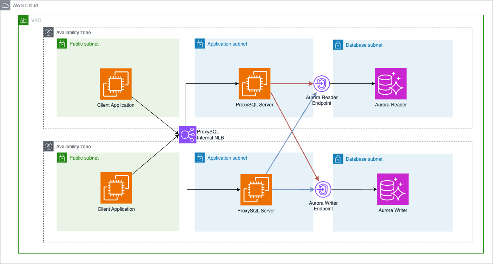

# ProxySQL Query Cache Integration with MySQL 8.0
The solution will create a high-available deployment of ProxySQL Servers on EC2 that can replace the deprecated MySQL Query Cache.



## Problem
MySQL Community removes Query Cache on MySQL8.0 and this could lead to performance dips for some workloads. In MySQL 5.7, the Query Cache has played a crucial role in optimizing database performance by caching query results, thus reducing CPU and memory load upon subsequent requests. However, its removal in MySQL 8.0 has led to increased resource utilization for some workloads, directly impacting those who relied heavily on this feature for performance optimization. 

Consequently, this necessitates a shift towards more advanced hardware configurations to handle the additional processing requirements, inadvertently escalating operational costs. This predicament has prompted a search for viable alternatives, highlighting the urgent need for innovative solutions to sustain efficiency and cost-effectiveness amidst evolving database technologies.

Additionally, with the retirement of MySQL 5.7, users are moving to MySQL 8.0. If they are using the Query Cache in MySQL 5.7, users will have to mitigate/fix the performance issue with alternative solution, e.g. modify application to optimize queries, optimize database schema & index, etc. However, in the specific case where it is impossible to modify application (e.g. they are using 3rd party application) or tune the database, they will require an intermediate solution to replace the original Query Cache.

## Goal
This solution provides the simplest deployable use case to alleviate performance issues resulting from MySQL Query Cache Deprecation. You can also use this to get started with ProxySQL on Aurora MySQL or RDS MySQL. 

## Solution Overview:
This solution will set up the following:
- 1x Internal Network Load Balancer
- 2x EC2 with ProxySQL installed (Private Subnets, Highly-Available Architecture)
- 1x Aurora MySQL5.7 Cluster (for benchmarking comparison)
- 1x Aurora MySQL8.0 Cluster
- 1x EC2 with Sysbench installed (Public Subnet, for testing and benchmarking purposes)

## Pre-requisites:
- Region: ap-southeast-1
- Available CIDR Block: 10.3.0.0/16

## Setting Up:

### 1. Download the repository and create the stack
Stack Creation will take around 5-10mins.
```bash
git clone https://github.com/aws-samples/proxysql-to-replace-mysql-query-cache.git
cd proxysql-to-replace-mysql-query-cache
aws cloudformation create-stack --stack-name proxysql-demo --template-body file://proxysql-demo.yml
```

### 2. Fill up the appropriate credentials in scripts/init-db.bash
Go to CloudFormation Outputs and you can find the appropriate endpoints
- WRITER_ENDPOINT="" 
    - CloudFormation Output Aurora80WriterEndpoint
- READER_ENDPOINT="" 
    - CloudFormation Output Aurora80ReaderEndpoint
- MYSQL_ADMIN_USER="" 
    - default = admin
- MYSQL_ADMIN_PASSWORD="" 
    - default = mysqladmin

### 3. Connect to ProxySQL Instance 1
Use `EC2 Instance Connect Endpoint` to log into the first ProxySQL EC2 instance (proxysql-demo-EC2ProxySQL1)

### 4. Setup ProxySQL Instance 1
Run the `scripts/init-db.bash` script by copy and pasting into the command line of ProxySQL Instance 1. 

If you receive `-bash: mysql: command not found` error, in the command line of ProxySQL Instance 1:
1. Run `sudo su`
2. Copy and paste the contents from `scripts/install-proxysql-and-mysql.bash` into the command line
3. run `exit`
4. Re-run `scripts/init-db.bash`.

### 5. Connect to ProxySQL Instance 2
Use `EC2 Instance Connect Endpoint` to log into the second ProxySQL EC2 instance (proxysql-demo-EC2ProxySQL2)

### 6. Setup ProxySQL Instance 2 
Run the `scripts/init-db.bash` script by copy and pasting into the command line of ProxySQL Instance 2. 

If you receive `-bash: mysql: command not found` error, in the command line of ProxySQL Instance 1:
1. Run `sudo su`
2. Copy and paste the contents from `scripts/install-proxysql-and-mysql.bash` into the command line
3. run `exit`
4. Re-run `scripts/init-db.bash`.

### 7. Connect to proxysql from a testing server!
We have provisioned a testing instance in one of the public subnets. You can access this instance from the EC2 Console (proxysql-demo-sysbench). Use `EC2 Instance Connect`, not `EC2 Instance Connect Endpoint`.

Once inside the Sysbench test server, run the following command to check if the Proxysql servers are up and running. **You can find the NLB Endpoints from CloudFormation Outputs**: 
    ```
    curl <NLB-endpoint>
    ```
- You will see "Hello from proxysql Instance 1" or "Hello from proxysql instance 2" if you are successful
- Run the following commands. 
    ```
    sysbench --version
    mysql --version
    ```
- If you do not see the version being listed, copy and paste the `scripts/install-sysbench.bench` to install the necessary modules. 
- To connect to your ProxySQL Instances, run the following commmand:
    ```
    mysql -h <NLB-Endpoint> -ustnduser -pstnduser -P3306
    ```

You can now connect to ProxySQL from the test server!

Congratulations, you are now able to connect to your MySQL Cluster via a Highly Available Deployment of ProxySQL

## Scripts
There are a couple of helper scripts that can be found in the `scripts/` folder. This section provides a brief look into what they do.

These scripts are not recommended to be used in production as they expose credentials to the EC2 instance. It is best practice to integrate parameters and credentials with a secure sevice, such as AWS Secrets Manager or AWS Parameter Store. 

For the purpose of the demo and for convenience, the scripts are provided.

### init-db.bash
This script initialises the ProxySQL Server and Aurora MySQL 8.0 Database with the necessary ProxySQL permissions and settings.

Most notably, you will need to fill in the following parameters in the script. The writer and reader endpoints should point to Aurora MySQL 8.0, and they can be found in the CloudFormation Outputs section. The Admin user and password should be set according to best practices. In the recommended demo, we have set it to default to `MYSQL_ADMIN_USER=admin` and `MYSQL_ADMIN_PASSWORD=mysqladmin`.

    ```
    # Aurora Cluster variables
    export WRITER_ENDPOINT=""
    export READER_ENDPOINT=""
    export MYSQL_ADMIN_USER=""
    export MYSQL_ADMIN_PASSWORD=""
    ```

If you are unsure if ProxySQL is connected, you can run the following commands in the script. These commands provide us insight as to whether the ProxySQL-Aurora integration has been correctly setup. Look at the ProxySQL documentation if more help is needed:
    ```
    execute_proxysql_command "SELECT * FROM monitor.mysql_server_connect_log ORDER BY time_start_us DESC LIMIT 3;"
    execute_proxysql_command "SELECT * FROM monitor.mysql_server_ping_log ORDER BY time_start_us DESC LIMIT 3;"
    ```

### install-proxysql-and-mysql.bash
This script installs the necessary resources to run proxysql locally. On some scenarios, the EC2 is unable to install proxysql and this script must be run manually after startup.

### install-sysbench.bash
This script installs the necessary resources to run sysbench, inclusive of sysbench v1.1.0-2ca9e3f. On some scenarios, the EC2 is unable to install sysbench and this script must be run manually after startup. This script should be run on the `sysbench EC2 Instance`.

Sysbench is a widely-used, open-source performance benchmarking tool for databases. You can use sysbench to run your performance tests from the `sysbench EC2 Instance` which is included in this template.

This script is only needed if you want to run performance tests via the `Sysbench EC2 Instance`.

### setup-sysbench.bash
This Script sets up the sysbench tables and environment from the `Sysbench EC2 instance`.
Appropriate sysbench tables will be created on your MySQL5.7 and MySQL8.0 Databases. Note that in this template, we have spun up 2 Databases: (1) Aurora MySQL 8.0, and (2) Aurora MySQL 5.7. The Aurora MySQL 5.7 database is there to help in benchmarking tests.

Take note that you will need to fill up the following variables:
    ```
    export MYSQL_USER="fill_up"
    export MYSQL_PASSWORD="fill_up"
    export MYSQL_HOST="fill_up_with_MySQL5.7_writer"
    ```

and also do not forget the variable near the bottom of the script:

    ```
    export MYSQL_HOST="fill_up_with_MySQL8.0_writer"
    ```

This script is only needed if you want to run performance tests via the `Sysbench EC2 Instance`.

### tune.sql
This script is to be run on the ProxySQL servers as it helps to tune the different parameters accordingly. You must first log into the ProxySQL server in order to run the script. You should log in as the ProxySQL admin account. The default credentials are shown below. The admin user should have been set in `scripts/init-db.bash`:
    ```
    mysql -h127.0.0.1 -uadmin -padmin -P6032
    ```

It is not recommended to adjust the script unless you have a good understanding of the parameters. These can be found in the official ProxySQL site.

The script will Flush the Query Cache when run. Also, if you are looking turn off the query cache,
you will find this command: `update mysql_query_rules set cache_ttl=300000 where rule_id=51;` and you can change the `cache_ttl=null` and rerun the script.

### visualize.sql
This script is to be run on the ProxySQL servers as it runs a set of commands that gives information into what is happening in ProxySQL, and some parameters that have been set.

You must first log into the ProxySQL server in order to run the script. You should log in as the ProxySQL admin account. The default credentials are shown below. The admin user should have been set in `scripts/init-db.bash`:
    ```
    mysql -h127.0.0.1 -uadmin -padmin -P6032
    ```

Note that running this will flush Query Cache Statistics. 

You should flush statistics after you have initiated the database setup in `scripts/setup-sysbench.bash`.

If you want to visualize your ProxySQL instance without flushing the cache, you can comment out the following line:
`select * from stats_mysql_query_digest_reset limit 1;`

## ProxySQL Testing
It is highly recommended that you download sysbench and execute a test from one of your devices. You can compare the benchmarking results from the benchmarking tests under benchmarking-1.1.

Follow the following steps to install sysbench and setup the sysbench server for testing

### 1. Install Sysbench
Copy and paste the script from `scripts/install-sysbench.bash`. This installs the necessary packages + Sysbench v1.1 into the Sysbench server.

### 2. Setup the necessary sysbench tables
Fill up the necessary parameters from the `scripts/setup-sysbench.bash` script. Take note to fill up the `MySQL8.0_writer` parameter, which is located near the bottom of the script

Copy and paste the script into the command line and run it. This script creates the necessary benchmarking tables.

### 3. Start Benchmarking!
There are 2 main benchmarking tests that can be done. As we are testing the efficacy of the Query Cache, we will focus only on reads.

1. OLTP read only
2. OLTP point select

You can investigate the folder benchmarking-1.1 to find out the different kinds of tests and their results.

#### benchmarking-1.1/oltp-point-select
3 scripts are present to conduct tests. `oltp-ps-test-mysql57.bash` and `oltp-ps-test-mysql80.bash` scripts will connect directly to the Aurora MySQL databases, while `oltp-ps-test-mysql80-cache.bash` will run a test on the ProxySQL Instance.

Additionally, the scripts require different user credentials. Connecting to ProxySQL will need a proxySQL user (defaulted to be `stnduser`). The other scripts that connect directly to Aurora MySQL will need a user that can connect with the necessary permissions. This is the credentials that you used in the CloudFormation Parameters to specify users. The defaults are USER=`admin`, PASSWORD=`mysqladmin`. 

Fill up the appropriate variables in the different scripts:
1. `oltp-ps-test-mysql57.bash`:
    - MYSQL_USER = User with necessary permissions to run sysbench tests
    - MYSQL_PASSWORD = Password of User with necessary permissions to run sysbench tests
    - MYSQL_HOST = MySQL 5.7 Writer Endpoint

2. `oltp-ps-test-mysql80.bash`:
    - MYSQL_USER = User with necessary permissions to run sysbench tests
    - MYSQL_PASSWORD = Password of User with necessary permissions to run sysbench tests
    - MYSQL_HOST = MySQl 8.0 Writer Endpoint

3. `oltp-ps-test-mysql80-cache.bash`:
    - MYSQL_USER = User with necessary permissions to run sysbench tests, (default = stnduser)
    - MYSQL_PASSWORD = Password of User with necessary permissions to run sysbench tests, (default = stnduser)
    - MYSQL_HOST = NLB Endpoint
    - For this test, we are running the test on the ProxySQL instance. To fully test the efficacy of the solution, you should use the NLB endpoint. If you want to connect directly to the ProxySQL Instance, you can use the Ip Address but it is not recommended as results might differ and you lose the High-Availability that comes with this solution.

Copy and paste the scripts into the `Sysbench EC2 Instance` to start running the test.

#### benchmarking-1.1/oltp-read-only
Here, 3 scripts are also present to conduct tests. `oltp-ro-test-mysql57.bash` and `oltp-ro-test-mysql80.bash` scripts will connect directly to the Aurora MySQL databases, while `oltp-ro-test-mysql80-cache.bash` will run a test on the ProxySQL Instance.

Additionally, the different scripts will need different user credentials. The script connect to ProxySQL will need a proxySQL user (defaulted to be `stnduser`). The other scripts will need a user that can connect with the necessary permissions. This is the credentials that you used in the CloudFormation Parameters to specify users. The defaults are USER=`admin`, PASSWORD=`mysqladmin`. 

Fill up the appropriate variables in the different scripts:
1. `oltp-ps-test-mysql57.bash`:
    - MYSQL_USER = User with necessary permissions to run sysbench tests
    - MYSQL_PASSWORD = Password of User with necessary permissions to run sysbench tests
    - MYSQL_HOST = MySQL 5.7 Writer Endpoint

2. `oltp-ps-test-mysql80.bash`:
    - MYSQL_USER = User with necessary permissions to run sysbench tests
    - MYSQL_PASSWORD = Password of User with necessary permissions to run sysbench tests
    - MYSQL_HOST = MySQl 8.0 Writer Endpoint

3. `oltp-ps-test-mysql80-cache.bash`:
    - MYSQL_USER = User with necessary permissions to run sysbench tests, (default = stnduser)
    - MYSQL_PASSWORD = Password of User with necessary permissions to run sysbench tests, (default = stnduser)
    - MYSQL_HOST = NLB Endpoint
    - For this test, we are running the test on the ProxySQL instance. To fully test the efficacy of the solution, you should use the NLB endpoint. If you want to connect directly to the ProxySQL Instance, you can use the Ip Address but it is not recommended as results might differ and you lose the High-Availability that comes with this solution.

## Disclaimer
The assets here are to be used only as a Proof-of-Concept. It is strongly recommended to review and test all assets in the repository before moving to a true production workload.

Additionally, this solution interacts with the following open-source software:
- [Sysbench](https://github.com/akopytov/sysbench)
- [ProxySQL](https://proxysql.com/)

They each have different terms of use published, and might have pricing requirements for production use cases. You should be familiar with their pricing and terms and conditions, ensuring that your use case complies with their terms before proceeding.

## Security

See [CONTRIBUTING](CONTRIBUTING.md#security-issue-notifications) for more information.

## License

This library is licensed under the MIT-0 License. See the LICENSE file.

## References:
- [ProxySQL Documentation](https://proxysql.com/documentation/)
- [ProxySQL Query Cache Scaling](https://proxysql.com/blog/scaling-with-proxysql-query-cache/)
- [How to use ProxySQL with open source platforms to split SQL reads and writes on Amazon Aurora clusters](https://aws.amazon.com/blogs/database/how-to-use-proxysql-with-open-source-platforms-to-split-sql-reads-and-writes-on-amazon-aurora-clusters/)
- [MySQL 8.0: Retiring Support for the Query Cache](https://dev.mysql.com/blog-archive/mysql-8-0-retiring-support-for-the-query-cache/)
- [Scaling with ProxySQL Query Cache](https://proxysql.com/blog/scaling-with-proxysql-query-cache/)
- [Amazon RDS for MySQL 5.7 will reach end of standard support on February 29, 2024](https://repost.aws/articles/ARWm1Gv0vJTIKCblhWhPXjWg/announcement-amazon-rds-for-mysql-5-7-will-reach-end-of-standard-support-on-february-29-2024) 
- [Setup ProxySQL for High Availability](https://www.percona.com/blog/setup-proxysql-for-high-availability-not-single-point-failure/)

